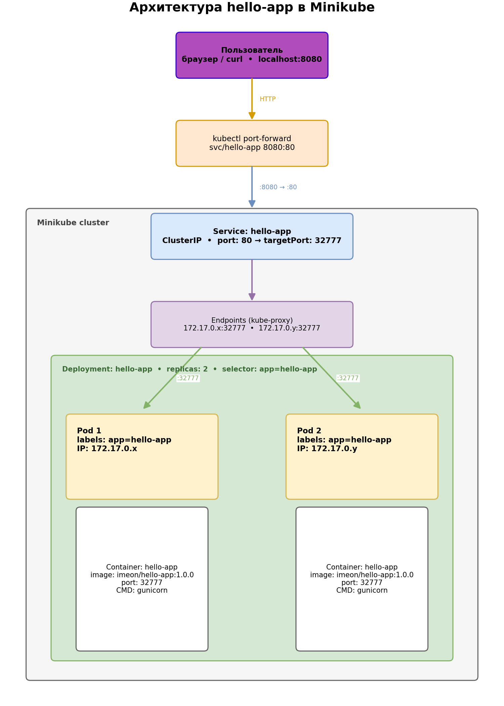

# hello-app

Веб-сервис «Hello World» на Python/Flask, упакованный в Docker и развёрнутый в локальном Kubernetes через Minikube. Слушает порт `32777`, запускается в 2 репликах, доступ к подам открывается через Service типа ClusterIP и `kubectl port-forward`.

## Состав репозитория

```
.
├── app.py                      # Flask-приложение
├── requirements.txt            # зависимости Python
## Вопросы и ответы

Полные ответы на теоретические вопросы и скриншоты с результатами работы вынесены в отдельный PDF-файл для аккуратного представления и печати:

- Документ: [docs/answers.pdf](docs/answers.pdf)
- Схема (draw.io): https://drive.google.com/file/d/1gJtV93H90MSnVCqSozx_Lxrzv9WVEdt-/view?usp=sharing

Просмотрите `docs/answers.pdf` для подробных ответов на все вопросы и наглядных скриншотов.
FROM → JOIN → WHERE → GROUP BY → HAVING → SELECT → DISTINCT → ORDER BY → LIMIT
```

Пример:

```sql
SELECT department, COUNT(*) AS emp_count
FROM employees
WHERE status = 'active'      -- до агрегации
GROUP BY department
HAVING COUNT(*) > 5;          -- после агрегации
```

Правило выбора простое: условие на отдельную строку — `WHERE`; условие на результат агрегации — `HAVING`.

## Практическое задание

### Локальный запуск приложения

```bash
python3 -m venv .venv && source .venv/bin/activate
pip install -r requirements.txt
APP_PORT=32777 python app.py
```

Проверка:

```bash
curl http://localhost:32777/
```

### Сборка и публикация образа

```bash
docker login
docker build -t imeon/hello-app:1.0.0 .
docker run --rm -p 32777:32777 imeon/hello-app:1.0.0
docker push imeon/hello-app:1.0.0
docker tag imeon/hello-app:1.0.0 imeon/hello-app:latest
docker push imeon/hello-app:latest
```

### Установка Minikube

Установка — по официальной инструкции: <https://minikube.sigs.k8s.io/docs/start/>.

Запуск кластера:

```bash
minikube start
minikube status
kubectl cluster-info
kubectl get nodes
```

### Деплой в Minikube

```bash
kubectl apply -f k8s/deployment.yaml
kubectl apply -f k8s/service.yaml

kubectl get pods -l app=hello-app -o wide
kubectl get svc hello-app
kubectl describe deployment hello-app
```

### Проброс портов

```bash
kubectl port-forward svc/hello-app 8080:80
```

Открываем в браузере: <http://localhost:8080/>.

Несколько вызовов `curl http://localhost:8080/` покажут разные `hostname` — сервис балансирует между двумя репликами.

### Очистка

```bash
# Ctrl+C в окне port-forward
kubectl delete -f k8s/
minikube stop
```

## Архитектура

Схема организации контейнеров и сервисов (draw.io):
https://drive.google.com/file/d/1gJtV93H90MSnVCqSozx_Lxrzv9WVEdt-/view?usp=sharing



Поток трафика:

1. Пользователь обращается на `localhost:8080`.
2. `kubectl port-forward` прокидывает трафик в `Service hello-app` (ClusterIP, порт 80).
3. kube-proxy через Endpoints балансирует запрос между двумя Pod'ами.
4. Каждый Pod слушает `32777` (targetPort сервиса).
5. gunicorn возвращает JSON с `hostname` пода — так видно, какая реплика ответила.

## Скриншоты

См. папку `docs/screenshots/`. Необходимый минимум:

1. `docker build` и `docker push`
2. Страница образа на Docker Hub
3. `minikube status` и `kubectl get nodes`
4. `kubectl get pods -l app=hello-app -o wide`
5. `kubectl get svc hello-app`
6. Терминал с запущенным `kubectl port-forward`
7. Окно браузера с ответом приложения
